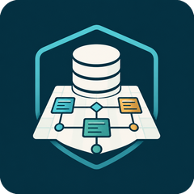
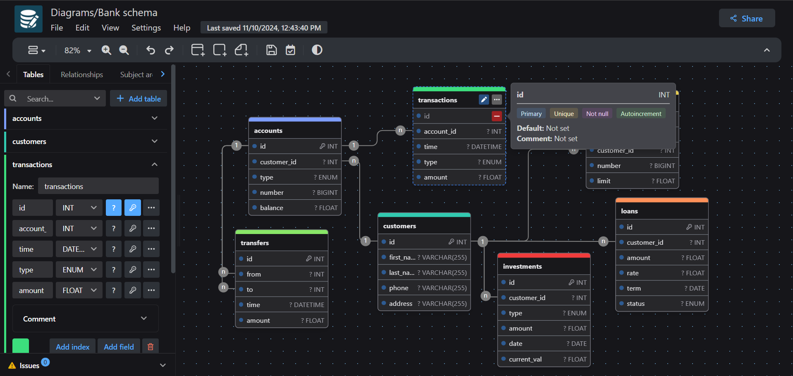

<div align="center">
    
    <h1>SchemaCanvas</h1>
</div>

<h3 align="center">Free, simple, and intuitive database schema editor and SQL generator.</h3>

<h3 align="center"></h3>

SchemaCanvas is a database entity-relationship (ER) diagram editor that runs entirely in your browser. Design a schema on a drag-and-drop canvas, generate SQL for it, or reverse-engineer a diagram from SQL you already have — all without creating an account.

## Features

- **Visual schema editor** — drag-and-drop tables, relationships, subject areas, and notes on a zoomable canvas, with undo/redo and keyboard shortcuts for almost every action.
- **SQL generation and import** — generate DDL for MySQL, PostgreSQL, SQLite, MariaDB, SQL Server, and a beta Oracle SQL dialect, or import an existing SQL script to reverse-engineer a diagram.
- **DBML and JSON import/export** — round-trip diagrams as DBML or JSON, or export a full local backup that can be re-imported later.
- **Multiple export formats** — PNG, JPEG, SVG, PDF, Markdown, and Mermaid, in addition to SQL and DBML.
- **Object-relational support** — custom types and enums for databases that support them (e.g. PostgreSQL).
- **Templates** — start from a built-in template or save your own diagrams as reusable templates.
- **Issue detection** — the editor flags structural problems (duplicate names, dangling relationships, circular dependencies, and more) as you work.
- **Local-first storage** — diagrams are saved to your browser's IndexedDB by default; nothing leaves your machine unless you explicitly share it.
- **Optional sharing and cloud sync** — point the app at your own compatible backend to enable link sharing, version history, or multi-user cloud diagrams. None of this is required for the core editor.
- **Accessibility** — keyboard navigable, with automated WCAG checks in CI.
- **Internationalization** — the UI is translated into 50+ languages.

## Supported Databases

MySQL · PostgreSQL · SQLite · MariaDB · SQL Server · Oracle SQL (beta) · Generic (dialect-agnostic)

## Getting Started

### Local Development

```bash
git clone https://github.com/Lynn-Lee/SchemaCanvas.git
cd SchemaCanvas
npm install
npm run dev
```

### Build

```bash
npm run build
```

### Docker

```bash
docker build -t schemacanvas .
docker run -p 3000:80 schemacanvas
```

## Configuration

SchemaCanvas works fully offline with no configuration. Sharing, version history, and cloud diagrams are optional and require pointing the app at your own compatible backend service via `VITE_BACKEND_URL` — see `.env.sample`. Until that's configured, those features stay hidden and no data ever leaves the browser.

## Tech Stack

React, Vite, Semi Design, Dexie (IndexedDB), i18next, Vitest, and Playwright.

## Contributing

Please see [CONTRIBUTING.md](CONTRIBUTING.md) for guidelines on how to contribute to this project.

## License

[GNU Affero General Public License v3.0](LICENSE)
